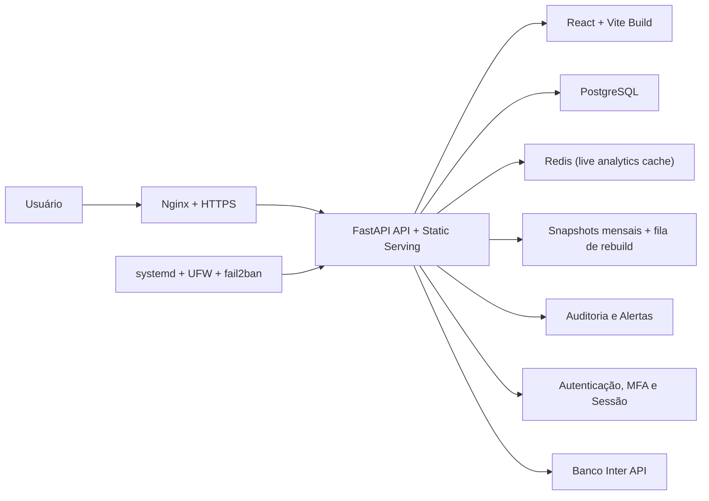

<p align="center">
  
</p>

<h1 align="center">Gestor Financeiro</h1>

<p align="center">
  Sistema financeiro full stack com foco em operação real, segurança, auditoria e deploy controlado em VPS.
</p>

<p align="center">
  
  
  
  
  
  
  
</p>

## Sobre o projeto

O Gestor Financeiro foi estruturado para ir além de um CRUD web tradicional. O projeto combina frontend em `React`, API em `FastAPI`, persistência em `PostgreSQL`, autenticação com `MFA`, trilha de auditoria e uma rotina operacional desenhada para rodar em servidor real, com ambientes separados de homologação e produção.

O resultado é um sistema que não se limita à interface ou ao backend isoladamente: ele cobre produto, regras de negócio, banco de dados, segurança, deploy, observabilidade e continuidade operacional.

## Destaques

- Aplicação web full stack para gestão financeira, cobrança, conciliação, compras e leitura gerencial.
- Backend em `FastAPI + SQLAlchemy` e frontend em `React + TypeScript + Vite`.
- Banco oficial em `PostgreSQL`, com migrações versionadas via `Alembic`.
- Integração nativa com a `API do Banco Inter` para extrato, cobranças e operação de boletos.
- Deploy oficial em `VPS KingHost`, com `Nginx`, `systemd`, `UFW`, `fail2ban` e healthchecks.
- Segurança reforçada com `MFA obrigatório`, `cookies HttpOnly`, `rate limit`, criptografia de campos, auditoria e alertas.
- Scripts operacionais para deploy, validação de ambiente, migração, backup e auditoria rápida de produção.
- Testes automatizados cobrindo segurança, autenticação e regras críticas de negócio.

## Novidades recentes

- Cache híbrido de analytics: meses históricos completos podem ser atendidos por snapshots persistidos no banco, enquanto períodos vivos usam `Redis`, com invalidação e rebuild coordenados no backend.
- Overview e compras não dependem mais de cache no frontend; a estratégia de cache passou a ficar centralizada no backend, com regras diferentes para analytics e planejamento de compras.
- Configuração de relatórios (`DRE` e `DRO`) com grupos e subgrupos que podem somar e subtrair dentro da mesma linha.
- Planejamento de compras com controle explícito de `devoluções`, exibidas separadamente do `recebido`.
- Gestão operacional de coleções com observações por coleção dentro do fluxo de planejamento.
- Exportação de boletos mais resiliente, com template `.xlsx` interno de fallback e compatibilidade com variações no nome da aba.
- Regra padrão para boletos mensais sem dia configurado: vencimento assumido no dia `20`.
- Documentação complementar em `docs/`, incluindo template de cobranças e auditoria recente de regra de negócio.

## O que este projeto evidencia

- Visão full stack de ponta a ponta, sem separar produto, backend, frontend e infraestrutura.
- Preocupação com operação real, e não apenas com execução local de desenvolvimento.
- Implementação de segurança em camadas, tanto na aplicação quanto na borda do servidor.
- Organização de deploy com fluxo controlado, validações pré-publicação e auditoria pós-deploy.
- Capacidade de sustentar, evoluir e operar uma aplicação além da entrega inicial.

## Condução e responsabilidade técnica

A condução deste projeto envolveu responsabilidade direta sobre arquitetura, execução e operação do sistema.

- Planejamento da estrutura da aplicação, definição dos módulos e priorização das entregas.
- Desenho da arquitetura `vps-first`, com separação de ambientes, estratégia de deploy e padrão operacional.
- Modelagem de banco, organização de migrações e evolução do schema conforme as necessidades do negócio.
- Implementação e integração entre frontend, backend, banco de dados, importações, relatórios e segurança.
- Endurecimento da aplicação com `MFA`, criptografia, cookies seguros, rate limit, trilha de auditoria e alertas.
- Implantação e validação da infraestrutura com `Nginx`, `systemd`, `UFW`, `fail2ban`, `PostgreSQL` e `HTTPS`.
- Criação de scripts de deploy, healthcheck, auditoria operacional, backup e rotinas de continuidade.
- Homologação de fluxos sensíveis, incluindo cobrança, conciliação, autenticação e operação em servidor real.
- Documentação de arquitetura, deploy, checklist de corte para PostgreSQL e padrões de operação.

Em síntese, trata-se de um projeto conduzido com preocupação real de engenharia: planejamento, construção, validação, auditoria e sustentação.

## Desenvolvimento assistido por IA

O projeto contou com apoio do `Codex` como acelerador de engenharia, principalmente para aumentar velocidade de implementação, revisão, documentação e refinamento técnico.

- Apoio na exploração do código e na abertura de frentes de trabalho com mais rapidez.
- Aceleração de implementações, refatorações e ajustes pontuais em backend, frontend, scripts e documentação.
- Suporte para expandir testes, revisar fluxos e reduzir trabalho repetitivo.
- Ajuda na organização e consolidação da documentação técnica.

O direcionamento permaneceu humano: escopo, arquitetura, decisões de segurança, fluxo operacional, auditoria do ambiente, revisão técnica e aprovação final das mudanças.

Em outras palavras, o uso de `Codex` aqui se encaixa em um fluxo de `AI-assisted development`, com autoria, curadoria técnica e responsabilidade final sobre o resultado.

## Módulos do sistema

- Visão geral com KPIs e leitura consolidada do período.
- Lançamentos financeiros e títulos em aberto.
- Conciliação bancária com importação OFX e sincronização de extrato via `API do Inter`.
- Cobrança, clientes e recebíveis com emissão e sincronização de boletos pelo `Banco Inter`.
- Compras e planejamento operacional, com marcas, coleções, pedidos, parcelas, devoluções e observações por coleção.
- Fluxo de caixa, DRE, DRO, projeções, comparativos e configuração persistida dos layouts gerenciais.
- Cadastros de contas, categorias, clientes e regras, incluindo configuração segura da conta `Inter`.
- Administração de usuários, backup, segurança e auditoria.
- Importações técnicas e históricas.

## Integração com a API do Inter

O sistema possui integração direta com a API do Banco Inter para reduzir trabalho manual em conciliação e cobrança.

- Sincronização de extrato bancário com deduplicação por transação.
- Sincronização de cobranças emitidas no Inter para atualizar status, linha digitável, código de barras, nosso número, `pix copia e cola` e valores recebidos.
- Emissão de boletos no Inter a partir da lista de `boletos faltando` do próprio sistema.
- Exportação de arquivo Excel de cobrança com template interno de fallback e tolerância a variações no nome da aba do modelo.
- Download de PDF individual ou em lote (`.zip`) para boletos emitidos pelo Inter.
- Cancelamento de cobranças pela API.
- Baixa manual pela API em ambiente `sandbox`, útil para homologação ponta a ponta.
- Suporte a `production` e `sandbox`, com sobrescrita opcional de `base URL` para testes.
- Garantia de que apenas uma conta ativa fique com a API do Inter habilitada por vez.
- Configuração mensal sem dia de vencimento passa a usar o dia `20` como padrão operacional no arquivo de exportação.

Para a emissão funcionar, o cadastro do cliente precisa estar completo com documento, endereço, CEP, cidade, UF e telefone.

## Arquitetura

O sistema segue uma arquitetura `backend serving frontend`: o frontend é compilado em `frontend/dist`, e o backend entrega tanto a API quanto os arquivos estáticos da aplicação web.

Na camada de analytics, a arquitetura passou a usar uma estratégia híbrida: consultas históricas mensais podem ser respondidas por snapshots persistidos em banco, enquanto janelas vivas e comparativos recentes usam `Redis`. Eventos de domínio limpam o cache vivo e podem enfileirar rebuild automático dos snapshots históricos afetados.



Topologia oficial no VPS:

- branch `main` -> ambiente `dev`
- branch `main` -> ambiente `prod`
- checkout `dev`: `/srv/salomao/dev/app`
- checkout `prod`: `/srv/salomao/prod/app`
- serviços: `salomao-dev.service` e `salomao-prod.service`

## Stack técnica

| Camada | Tecnologias | Papel no projeto |
| --- | --- | --- |
| Frontend | `React 18`, `TypeScript`, `Vite`, `React Router`, `react-select` | Interface, roteamento e experiência web |
| Backend | `FastAPI`, `SQLAlchemy 2`, `Pydantic Settings`, `psycopg`, `httpx`, `cryptography`, `redis-py` | API, integrações externas, modelagem, configuração, persistência, cache e segurança |
| Banco e schema | `PostgreSQL`, `Alembic` | Banco oficial, migrações versionadas e persistência dos snapshots históricos de analytics |
| Infraestrutura | `Nginx`, `systemd`, `UFW`, `fail2ban` | Proxy reverso, processo, firewall e proteção de borda |
| Qualidade | `pytest`, `ruff` | Testes automatizados e padronização de código |

## Cache e performance

O projeto passou a tratar cache como responsabilidade de backend, não mais da interface.

- `DRE`, `DRO`, `dashboard`, `fluxo de caixa` e comparativos de receita usam cache híbrido: mês histórico fechado pode ser servido por snapshot persistido; período vivo usa `Redis`.
- Invalidações de lançamentos, importações, conciliação, transferências e layouts de relatório limpam os caches vivos e podem disparar rebuild da fila de snapshots históricos impactados.
- O planejamento de compras continua com cache backend-only próprio, com chave por empresa, ano, filtros e modo de visualização, sem depender de armazenamento local do navegador.
- O recorte operacional atual privilegia reuso de leituras pesadas no servidor e preserva consistência quando eventos financeiros alteram a base analítica.

## Segurança em destaque

Um dos diferenciais mais fortes do projeto está na camada de segurança, especialmente no ambiente de servidor.

### Na aplicação

- `MFA obrigatório em modo servidor`.
- `Dispositivos confiáveis com expiração`.
- `Hash de senha com PBKDF2-SHA256`.
- `Criptografia de campos com AES-GCM`.
- `Sessão via cookie HttpOnly`.
- `Cookie secure e SameSite`.
- `Rate limit para login e MFA`.
- `State tokens assinados para desafios de autenticação`.
- `Credenciais sensíveis da integração Inter criptografadas`, incluindo `client secret`, certificado PEM e chave privada PEM.
- `Integração com certificado cliente (mTLS)` para autenticação na API do Inter.
- `Logs de auditoria` para login, logout, MFA e gestão de usuários.
- `Alertas de segurança` para tentativas suspeitas, abuso de rate limit e acesso fora do país permitido.
- `Headers defensivos`: `X-Frame-Options`, `X-Content-Type-Options`, `Referrer-Policy`, `Permissions-Policy` e `Cache-Control`.
- `Proteção contra path traversal` ao servir o frontend compilado.

### No servidor

- `HTTPS` atrás de `Nginx`.
- `UFW` para controle de portas.
- `fail2ban` para reforço contra abuso.
- `systemd` para supervisão do processo.
- `Healthchecks locais e públicos` após deploy.
- `Auditoria operacional` com validação de serviço, portas, SSH, TLS e componentes críticos.
- `Validação de segredos e modo de execução` quando `APP_MODE=server`.
- `PostgreSQL como banco oficial` do ambiente de servidor.

## Fluxo de deploy

O projeto é `vps-first`: a publicação oficial acontece somente no VPS da KingHost.

O branch oficial único é `main`. Os ambientes `dev` e `prod` usam checkouts separados no VPS, mas ambos acompanham `origin/main`.

Scripts padronizados:

- `scripts/deploy-dev.sh`
- `scripts/deploy-prod.sh`
- `scripts/deploy-vps.sh`
- `scripts/check-prod.sh`

Fluxo principal executado pelos scripts:

1. Validação de `backend/.env`.
2. Confirmação de `APP_MODE=server`.
3. Confirmação de `DATABASE_URL` em PostgreSQL.
4. `npm ci`.
5. `npm run build`.
6. `alembic upgrade head`.
7. Restart do serviço correto no `systemd`.
8. Healthcheck do ambiente.

Auditoria rápida de produção cobre:

- `backend/.env`
- `salomao-prod.service`
- `nginx`, `postgresql` e `fail2ban`
- healthcheck local e público
- portas expostas
- `UFW`
- política efetiva de SSH
- certificado HTTPS

## Banco, migrações e continuidade

O banco oficial do servidor é `PostgreSQL`, com schema evoluindo via `Alembic`.

O repositório também concentra rotinas de suporte operacional para:

- migração de SQLite para PostgreSQL
- backup operacional do PostgreSQL
- restauração de dumps
- retenção de backups
- backups criptografados no servidor
- snapshots mensais persistidos para analytics históricos
- fila de rebuild para recomposição seletiva de cache analítico

Isso reforça a preocupação com continuidade e manutenção do sistema ao longo do tempo, e não apenas com a primeira entrega.

## Testes e confiabilidade

O backend possui testes cobrindo pontos relevantes para produção, incluindo:

- primitivas de segurança e TOTP
- alertas de segurança e envio de e-mail
- fluxo de dispositivos confiáveis no MFA
- cálculos financeiros
- importações históricas
- cache híbrido de analytics, incluindo leitura de snapshot, cache vivo em Redis e composição entre histórico e período atual
- layouts e regras de relatórios, incluindo linhas com sinais mistos por grupo/subgrupo
- módulos de boletos e planejamento, incluindo devoluções separadas do recebido
- cliente HTTP da `API do Inter`
- sincronização de extrato do Inter com paginação e deduplicação
- emissão, sincronização, cancelamento, baixa em sandbox, download de PDF e exportação resiliente de boletos do Inter

## Estrutura do repositório

```text
.
|-- backend/
|   |-- app/
|   |-- scripts/
|   |-- tests/
|-- frontend/
|   |-- src/
|-- docs/
|-- scripts/
|-- README.md
```

## Arquivos importantes

- [docs/architecture.md](docs/architecture.md)
- [docs/auditoria-regra-negocio-2026-04-02.md](docs/auditoria-regra-negocio-2026-04-02.md)
- [docs/auditoria-regra-negocio-2026-04-02.pdf](docs/auditoria-regra-negocio-2026-04-02.pdf)
- [docs/deploy-vps.md](docs/deploy-vps.md)
- [docs/postgres-cutover-checklist.md](docs/postgres-cutover-checklist.md)
- [docs/Template_Cobranças_Arquivo_Excel.xlsx](docs/Template_Cobranças_Arquivo_Excel.xlsx)
- [backend/.env.example](backend/.env.example)
- [backend/.env.dev.example](backend/.env.dev.example)
- [backend/.env.prod.example](backend/.env.prod.example)
- [backend/app/services/boletos.py](backend/app/services/boletos.py)
- [backend/app/services/analytics_hybrid.py](backend/app/services/analytics_hybrid.py)
- [backend/app/services/cache_invalidation.py](backend/app/services/cache_invalidation.py)
- [backend/app/services/purchase_planning.py](backend/app/services/purchase_planning.py)
- [backend/app/services/report_layouts.py](backend/app/services/report_layouts.py)
- [backend/app/services/reports.py](backend/app/services/reports.py)
- [backend/app/services/inter.py](backend/app/services/inter.py)
- [backend/app/schemas/inter.py](backend/app/schemas/inter.py)
- [backend/tests/test_analytics_hybrid.py](backend/tests/test_analytics_hybrid.py)
- [backend/tests/test_boletos.py](backend/tests/test_boletos.py)
- [backend/tests/test_purchase_planning.py](backend/tests/test_purchase_planning.py)
- [backend/tests/test_inter_api_endpoints.py](backend/tests/test_inter_api_endpoints.py)
- [backend/tests/test_report_layouts.py](backend/tests/test_report_layouts.py)
- [scripts/deploy-dev.sh](scripts/deploy-dev.sh)
- [scripts/deploy-prod.sh](scripts/deploy-prod.sh)
- [scripts/check-prod.sh](scripts/check-prod.sh)

## Configuração mínima

```env
APP_MODE=server
DATABASE_URL=postgresql+psycopg://...
BOOTSTRAP_ADMIN_EMAIL=admin@example.invalid
BOOTSTRAP_ADMIN_PASSWORD=...
SESSION_SECRET=...
FIELD_ENCRYPTION_KEY=...
ANALYTICS_REDIS_URL=redis://127.0.0.1:6379/0
ANALYTICS_REDIS_PREFIX=salomao
PUBLIC_ORIGIN=https://salomao.example.invalid
```

Na primeira inicialização com banco vazio, defina `BOOTSTRAP_ADMIN_EMAIL` e `BOOTSTRAP_ADMIN_PASSWORD` para criar o administrador inicial. Depois do bootstrap, troque a senha pela interface e remova a senha inicial do arquivo de ambiente.

## Como habilitar a API do Inter

1. Acesse `Cadastros > Contas e categorias`.
2. Edite ou crie a conta bancária do Inter.
3. Ative `API Banco Inter`.
4. Informe `Ambiente`, `Client ID`, `Conta corrente Inter`, `Client secret`, `Certificado PEM` e `Chave privada PEM`.
5. Salve a conta. Se outra conta já estiver com a API do Inter habilitada, o sistema desabilita a anterior automaticamente.

Com a conta configurada, o sistema libera:

- sincronização de extrato em `Importações` e `Conciliação`
- sincronização de cobranças na tela de `Boletos`
- emissão de boletos faltando direto no Inter
- download de PDFs individuais ou em lote
- cancelamento de boletos e baixa manual em `sandbox`

## Panorama final

O Gestor Financeiro apresenta uma visão completa de engenharia aplicada: produto financeiro, frontend moderno, backend estruturado, persistência relacional, integração bancária real, segurança em múltiplas camadas, observabilidade operacional e deploy disciplinado em servidor Linux.

É um projeto que comunica capacidade de construir, evoluir e operar software com responsabilidade técnica, foco em confiabilidade e atenção aos detalhes que normalmente só aparecem em ambientes reais.
