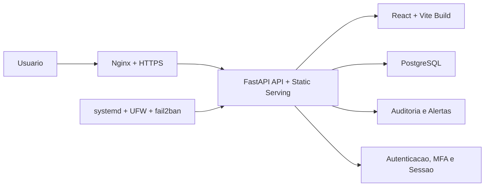

<p align="center">
  
</p>

<h1 align="center">Gestor Financeiro</h1>

<p align="center">
  Sistema financeiro full stack com foco em operacao real, seguranca de acesso e deploy controlado em VPS.
</p>

<p align="center">
  
  
  
  
  
  
  
</p>

## Sobre o projeto

Este projeto foi estruturado para ir alem de um CRUD web tradicional. Ele combina frontend em `React`, API em `FastAPI`, persistencia em `PostgreSQL`, autenticacao com `MFA`, trilha de auditoria e uma rotina operacional pensada para ambiente de servidor com `dev` e `prod`.

Do ponto de vista de portfolio, ele mostra capacidade de entregar produto, backend, frontend, banco e operacao com foco em confiabilidade e seguranca.

## Highlights

- Aplicacao web full stack para gestao financeira, cobranca, conciliacao, compras e leitura gerencial.
- Backend em `FastAPI + SQLAlchemy`, frontend em `React + TypeScript + Vite`.
- Banco oficial em `PostgreSQL`, com migracoes versionadas via `Alembic`.
- Deploy oficial em `VPS KingHost`, com `Nginx`, `systemd`, `UFW`, `fail2ban` e healthchecks.
- Seguranca reforcada com `MFA obrigatorio`, `cookies HttpOnly`, `rate limit`, `criptografia de campos`, `auditoria` e `alertas`.
- Scripts operacionais para deploy, validacao de ambiente, migracao e backup.
- Testes automatizados cobrindo seguranca, autenticacao e regras de negocio.

## O que este projeto comunica para recrutadores

- Visao full stack de ponta a ponta, sem separar produto e infraestrutura.
- Preocupacao com ambiente real de operacao, e nao apenas desenvolvimento local.
- Implementacao de seguranca em camadas, tanto no codigo quanto na borda do servidor.
- Organizacao de deploy com homologacao e producao separadas.
- Capacidade de sustentar uma aplicacao apos a entrega inicial.

## Modulos do sistema

- Visao geral com KPIs e leitura consolidada do periodo.
- Lancamentos financeiros e titulos em aberto.
- Conciliacao bancaria com importacao OFX.
- Cobranca, clientes e recebiveis.
- Compras e planejamento operacional.
- Fluxo de caixa, DRE, DRO, projecoes e comparativos.
- Cadastros de contas, categorias, clientes e regras.
- Administracao de usuarios, backup, seguranca e auditoria.
- Importacoes tecnicas e historicas.

## Arquitetura

O sistema segue uma arquitetura `backend serving frontend`: o frontend e compilado em `frontend/dist`, e o backend entrega tanto a API quanto os arquivos estaticos da aplicacao web.



Topologia oficial no VPS:

- branch `dev` -> ambiente `dev`
- branch `main` -> ambiente `prod`
- checkout `dev`: `/srv/salomao/dev/app`
- checkout `prod`: `/srv/salomao/prod/app`
- servicos: `salomao-dev.service` e `salomao-prod.service`

## Stack tecnica

| Camada | Tecnologias | Papel no projeto |
| --- | --- | --- |
| Frontend | `React 18`, `TypeScript`, `Vite`, `React Router`, `react-select` | Interface, roteamento e experiencia web |
| Backend | `FastAPI`, `SQLAlchemy 2`, `Pydantic Settings`, `psycopg`, `cryptography` | API, modelagem, configuracao, persistencia e seguranca |
| Banco e schema | `PostgreSQL`, `Alembic` | Banco oficial e migracoes versionadas |
| Infraestrutura | `Nginx`, `systemd`, `UFW`, `fail2ban` | Proxy reverso, processo, firewall e protecao de borda |
| Qualidade | `pytest`, `ruff` | Testes automatizados e padrao de codigo |

## Seguranca em destaque

Um dos diferenciais mais fortes do projeto esta na camada de seguranca, principalmente no servidor.

### Na aplicacao

- `MFA obrigatorio em modo servidor`.
- `Dispositivos confiaveis com expiracao`.
- `Hash de senha com PBKDF2-SHA256`.
- `Criptografia de campos com AES-GCM`.
- `Sessao via cookie HttpOnly`.
- `Cookie secure e SameSite`.
- `Rate limit para login e MFA`.
- `State tokens assinados para desafios de autenticacao`.
- `Logs de auditoria` para login, logout, MFA e gestao de usuarios.
- `Alertas de seguranca` para tentativas suspeitas, abuso de rate limit e acesso fora do pais permitido.
- `Headers defensivos`: `X-Frame-Options`, `X-Content-Type-Options`, `Referrer-Policy`, `Permissions-Policy` e `Cache-Control`.
- `Protecao contra path traversal` ao servir o frontend compilado.

### No servidor

- `HTTPS` atras de `Nginx`.
- `UFW` para controle de portas.
- `fail2ban` para reforco contra abuso.
- `systemd` para supervisao do processo.
- `Healthchecks locais e publicos` apos deploy.
- `Auditoria operacional` com validacao de servico, portas, SSH, TLS e componentes criticos.
- `Validacao de segredos e modo de execucao` quando `APP_MODE=server`.
- `PostgreSQL como banco oficial` do ambiente de servidor.

## Fluxo de deploy

O projeto e `vps-first`: a publicacao oficial acontece somente no VPS da KingHost.

Scripts padronizados:

- `scripts/deploy-dev.sh`
- `scripts/deploy-prod.sh`
- `scripts/deploy-vps.sh`
- `scripts/check-prod.sh`

Fluxo principal executado pelos scripts:

1. Validacao de `backend/.env`.
2. Confirmacao de `APP_MODE=server`.
3. Confirmacao de `DATABASE_URL` em PostgreSQL.
4. `npm ci`.
5. `npm run build`.
6. `alembic upgrade head`.
7. Restart do servico correto no `systemd`.
8. Healthcheck do ambiente.

Auditoria rapida de producao cobre:

- `backend/.env`
- `salomao-prod.service`
- `nginx`, `postgresql` e `fail2ban`
- healthcheck local e publico
- portas expostas
- `UFW`
- politica efetiva de SSH
- certificado HTTPS

## Banco, migracoes e continuidade

O banco oficial do servidor e `PostgreSQL`, com schema evoluindo via `Alembic`.

O repositorio tambem concentra rotinas de suporte operacional para:

- migracao de SQLite para PostgreSQL
- backup operacional do PostgreSQL
- restauracao de dumps
- retencao de backups
- backups criptografados no servidor

Isso mostra preocupacao com continuidade e manutencao do sistema ao longo do tempo, nao apenas com a primeira entrega.

## Testes e confianca

O backend possui testes cobrindo pontos relevantes para producao, incluindo:

- primitivas de seguranca e TOTP
- alertas de seguranca e envio de email
- fluxo de dispositivos confiaveis no MFA
- calculos financeiros
- importacoes historicas
- layouts e regras de relatorios
- modulos de boletos e planejamento

## Estrutura do repositorio

```text
.
|-- backend/
|   |-- app/
|   |-- scripts/
|   |-- tests/
|-- frontend/
|   |-- src/
|-- docs/
|-- scripts/
|-- README.md
```

## Arquivos importantes

- [docs/architecture.md](docs/architecture.md)
- [docs/deploy-vps.md](docs/deploy-vps.md)
- [docs/postgres-cutover-checklist.md](docs/postgres-cutover-checklist.md)
- [backend/.env.example](backend/.env.example)
- [backend/.env.dev.example](backend/.env.dev.example)
- [backend/.env.prod.example](backend/.env.prod.example)
- [scripts/deploy-dev.sh](scripts/deploy-dev.sh)
- [scripts/deploy-prod.sh](scripts/deploy-prod.sh)
- [scripts/check-prod.sh](scripts/check-prod.sh)

## Configuracao minima

```env
APP_MODE=server
DATABASE_URL=postgresql+psycopg://...
BOOTSTRAP_ADMIN_EMAIL=admin@example.invalid
BOOTSTRAP_ADMIN_PASSWORD=...
SESSION_SECRET=...
FIELD_ENCRYPTION_KEY=...
PUBLIC_ORIGIN=https://salomao.example.invalid
```

Na primeira inicializacao com banco vazio, defina `BOOTSTRAP_ADMIN_EMAIL` e `BOOTSTRAP_ADMIN_PASSWORD` para criar o administrador inicial. Depois do bootstrap, troque a senha pela interface e remova a senha inicial do arquivo de ambiente.

## Resumo final

Este projeto se destaca por mostrar uma visao completa de engenharia: produto financeiro, frontend moderno, backend estruturado, persistencia relacional, seguranca de autenticacao, observabilidade operacional e deploy disciplinado em servidor Linux.

Para um perfil GitHub, ele comunica bem capacidade de construir e sustentar uma aplicacao real, com preocupacoes de entrega, confiabilidade e seguranca.
