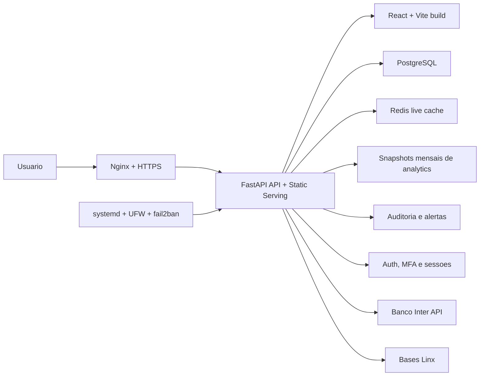

<p align="center">
  
</p>

<h1 align="center">Sistema Salomao</h1>

<p align="center">
  Gestor financeiro full stack para operacao real, com integracao bancaria, leitura gerencial, seguranca, auditoria e deploy controlado em VPS.
</p>

<p align="center">
  
  
  
  
  
  
  
  
</p>

## Sobre o projeto

O Sistema Salomao e uma aplicacao financeira full stack criada para operar alem do ciclo de desenvolvimento local. O projeto combina frontend web, API, banco relacional, integracoes externas, seguranca, rotinas de importacao, observabilidade operacional e deploy disciplinado em servidor.

A arquitetura atual e `vps-first`: o backend `FastAPI` entrega a API e o build estatico do frontend `React + Vite`, enquanto os ambientes oficiais `dev` e `prod` rodam em VPS KingHost com `PostgreSQL`, `Nginx`, `systemd`, `UFW`, `fail2ban` e GitHub Actions com self-hosted runner.

## Destaques

- Gestao financeira com lancamentos, titulos em aberto, baixa, conciliacao, cobranca, compras, fluxo de caixa, DRE, DRO e comparativos.
- Integracao com Banco Inter para extrato, cobrancas, boletos, PDF, cancelamento e baixa em sandbox.
- Integracoes Linx para clientes, fornecedores, produtos, movimentos, vendas, faturas a receber e liquidacao de recebiveis.
- Dashboard gerencial em `/overview/resumo` com KPIs, leitura de caixa, DRE resumido, comparativo de receita, saldos por conta, vencidos e aniversariantes da semana.
- Planejamento de compras por marca, fornecedor e colecao, com notas fiscais, parcelas, devolucoes, margens e impacto no caixa.
- Cache hibrido de analytics com Redis para janelas vivas e snapshots mensais persistidos para historico.
- Seguranca com MFA obrigatorio em modo servidor, cookies HttpOnly, rate limit, criptografia de campos, auditoria, alertas e headers defensivos.
- Deploy oficial via GitHub Actions no VPS, com homologacao automatica em `dev` e producao manual.
- Workflows operacionais para refresh do banco dev, sanitizacao, modo seguro, qualidade e verificacoes de seguranca.
- Suite de testes cobrindo seguranca, calculos financeiros, Inter, Linx, boletos, planejamento, relatorios, cache e importacoes.

## Novidades recentes

- Novo shell da aplicacao com navegacao principal, drawer mobile, busca global de produtos, status do ambiente e CTA para novo lancamento.
- Biblioteca interna de UI em `frontend/src/components/ui/` com `Button`, `Card`, `Field`, `Input`, `Select`, `Modal`, `DropdownMenu`, `KpiCard`, `Sparkline`, `StatusPill`, `Badge`, `EmptyState`, `ErrorState`, `ErrorBoundary` e `PeriodChips`.
- Dashboard principal redesenhado em `/overview/resumo`, com componentes dedicados e layout independente do legado.
- Padronizacao progressiva de tabelas compactas e responsivas para telas operacionais como lancamentos, cobranca, boletos e conciliacao.
- Area de cobranca reorganizada em faturas e boletos, incluindo boletos recorrentes, avulsos, pendencias, exportacao, importacao C6 e operacoes via Inter.
- Cadastros Linx expandidos para clientes e fornecedores, produtos, movimentos e faturas a receber.
- Relatorio de vendas Linx em `Resultados > Vendas`, com filtros, paginacao e leitura por nota, cliente e periodo.
- Comparativos de resultados em `Resultados > Comparativos`, alem de DRE, DRO, fluxo de caixa e projecoes.
- Workflows adicionais para `quality`, `security-checks`, refresh/sanitizacao de dev e controle de modo seguro.

## Modulos do sistema

| Area | Principais recursos |
| --- | --- |
| Visao geral | KPIs, caixa consolidado, DRE resumido, comparativo de receita, saldos, vencidos e aniversariantes |
| Lancamentos | Consulta financeira, filtros, lote, baixa, titulos em aberto, transferencias e recorrencias |
| Conciliacao | Importacao OFX, extrato Inter, matching, conciliacao e desconciliacao |
| Cobranca | Faturas Linx, boletos Inter, boletos avulsos, pendencias, PDF, cancelamento, baixa sandbox e importacoes C6 |
| Compras | Planejamento por marca/colecao, notas fiscais, parcelas, fornecedores, devolucoes, margens e previsoes |
| Resultados | Fluxo de caixa, relatorio de vendas, DRE, DRO, projecoes e comparativos |
| Cadastros | Contas, categorias, clientes, fornecedores, produtos, movimentos, faturas e regras |
| Sistema | Usuarios, MFA, backups, configuracoes Linx, integracoes e importacoes gerais |

## Arquitetura

O backend serve a API e os arquivos estaticos gerados por `frontend/dist`. Em producao, o trafego publico passa por `Nginx + HTTPS`; o processo Python e supervisionado por `systemd`; e o banco oficial e `PostgreSQL`.



Topologia oficial:

- `dev`: homologacao no VPS, branch `dev`, servico `salomao-dev.service`, healthcheck `http://127.0.0.1:8101/api/v1/health`, acesso privado via Tailscale.
- `prod`: producao no VPS, promocao manual, servico `salomao-prod.service`, healthcheck `http://127.0.0.1:8100/api/v1/health`, exposicao publica via Nginx e HTTPS.

## Stack tecnica

| Camada | Tecnologias |
| --- | --- |
| Frontend | `React 19`, `TypeScript 6`, `Vite 8`, `React Router 7`, `react-select` |
| Backend | `FastAPI`, `SQLAlchemy 2`, `Pydantic Settings`, `psycopg`, `httpx`, `cryptography`, `redis-py`, `pypdf` |
| Banco e schema | `PostgreSQL`, `Alembic` |
| Infraestrutura | `Nginx`, `systemd`, `UFW`, `fail2ban`, `Tailscale`, `GitHub Actions self-hosted runner` |
| Qualidade | `pytest`, `ruff`, `tsc`, `vite build`, scan de seguranca do repositorio |

## Integracao com Banco Inter

O sistema possui integracao direta com a API do Banco Inter para reduzir trabalho manual de conciliacao e cobranca.

- Sincronizacao de extrato com paginacao e deduplicacao por transacao.
- Sincronizacao de cobrancas para atualizar status, linha digitavel, codigo de barras, nosso numero, Pix copia e cola e valores recebidos.
- Emissao de boletos a partir da lista de boletos faltantes.
- Download de PDF individual ou em lote `.zip`.
- Cancelamento de cobrancas pela API.
- Baixa manual em ambiente `sandbox` para homologacao ponta a ponta.
- Suporte a `production` e `sandbox`, com base URL sobrescrevivel para testes.
- Credenciais sensiveis criptografadas em banco, incluindo `client secret`, certificado PEM e chave privada PEM.
- Garantia de apenas uma conta ativa com API Inter habilitada por vez.

Para emitir boletos, o cliente precisa ter documento, endereco, CEP, cidade, UF e telefone cadastrados.

## Integracoes Linx

As bases Linx alimentam a leitura operacional e gerencial do sistema:

- Clientes e fornecedores, com classificacao, status e dados de cobranca.
- Produtos, custos, precos, fornecedor e colecao.
- Movimentos de venda, compra, devolucao e entradas relevantes para analise de lucro por colecao.
- Faturas a receber e espelho do crediario.
- Liquidacao de recebiveis e rotinas API-first de atualizacao.
- Relatorio de vendas por periodo, cliente, nota e totais consolidados.
- Aniversariantes da semana no dashboard, usando historico de compras para contexto comercial.

## Cache e performance

O backend centraliza cache e recomposicao de leituras pesadas.

- `dashboard`, `DRE`, `DRO`, `fluxo de caixa` e comparativos usam cache hibrido.
- Periodos historicos fechados podem ser servidos por snapshots persistidos.
- Periodos vivos e consultas recentes usam Redis.
- Eventos de lancamentos, importacoes, conciliacao, transferencias e layouts invalidam caches afetados.
- Planejamento de compras possui cache backend-only por empresa, ano, filtros e modo de visualizacao.

## Seguranca

Na aplicacao:

- MFA obrigatorio em modo servidor.
- Dispositivos confiaveis com expiracao.
- Hash de senha com PBKDF2-SHA256.
- Criptografia de campos com AES-GCM.
- Sessao via cookie HttpOnly, com `Secure` e `SameSite` em servidor.
- Rate limit para login e MFA.
- State tokens assinados para desafios de autenticacao.
- Auditoria de login, logout, MFA e gestao de usuarios.
- Alertas de seguranca para tentativas suspeitas, abuso de rate limit e acesso fora do pais permitido.
- Headers defensivos e protecao contra path traversal no static serving.

No servidor:

- HTTPS atras de Nginx.
- UFW, fail2ban e SSH restrito ao Tailscale.
- Healthchecks em deploy.
- Auditoria operacional com validacao de servico, portas, TLS, SSH, banco e componentes criticos.
- Segredos fora do repositorio, com exemplos versionados apenas para referencia.

## Deploy e operacao

O projeto nao usa deploy local como caminho oficial. O deploy normal acontece pelo GitHub Actions no VPS.

| Workflow | Trigger | Funcao |
| --- | --- | --- |
| `Deploy Dev` | push em `dev` + manual | deploy automatico de homologacao |
| `Deploy Prod` | manual | deploy manual de producao a partir de SHA imutavel |
| `Quality` | push/PR conforme workflow | backend, frontend e validacoes de qualidade |
| `Security Checks` | conforme workflow | verificacoes de seguranca do repositorio |
| `Refresh Dev DB` | manual | copia prod para dev e aplica modo seguro |
| `Sanitize Dev DB` | manual | anonimiza dados sensiveis no dev |
| `Set Dev Safety Mode` | manual | alterna dev entre `safe` e `validate` |

Politica operacional:

- `dev` e a branch normal de trabalho e homologacao.
- `main` representa producao e so deve ser promovida manualmente.
- A IA nao faz deploy direto no VPS por SSH.
- Producao e promocao para `main` permanecem manuais.
- Depois de push em `dev`, o run de `Deploy Dev` deve ser acompanhado ate o status final.

Scripts principais:

- `scripts/deploy-dev.sh`
- `scripts/deploy-prod.sh`
- `scripts/deploy-vps.sh`
- `scripts/check-prod.sh`
- `scripts/sync-checkout-to-ref.sh`
- `scripts/refresh-dev-db-from-prod.sh`
- `scripts/post-refresh-dev.sh`
- `scripts/sanitize-dev-db.sh`
- `scripts/set-dev-safety-mode.sh`
- `scripts/security_scan.py`

## Configuracao

O arquivo real de runtime deve ficar fora do repositorio, por padrao em `../salomao-config/backend.env`. O backend aceita override por `SALOMAO_ENV_FILE` ou `BACKEND_ENV_FILE` e mantem `backend/.env` apenas como fallback legado.

Arquivos versionados de referencia:

- `backend/.env.example`
- `backend/.env.dev.example`
- `backend/.env.prod.example`

Configuracao minima:

```env
APP_MODE=server
DATABASE_URL=postgresql+psycopg://...
BOOTSTRAP_ADMIN_EMAIL=admin@example.invalid
BOOTSTRAP_ADMIN_PASSWORD=...
SESSION_SECRET=...
FIELD_ENCRYPTION_KEY=...
ANALYTICS_REDIS_URL=redis://127.0.0.1:6379/0
ANALYTICS_REDIS_PREFIX=salomao
PUBLIC_ORIGIN=https://salomao.example.invalid
```

Na primeira inicializacao com banco vazio, defina `BOOTSTRAP_ADMIN_EMAIL` e `BOOTSTRAP_ADMIN_PASSWORD` para criar o administrador inicial. Depois do bootstrap, troque a senha pela interface e remova a senha inicial do arquivo de ambiente.

## Desenvolvimento local

Backend:

```powershell
cd backend
uv sync --extra dev
$env:PYTHONPATH='.'
uv run pytest
```

Frontend:

```powershell
cd frontend
npm ci
npm run typecheck
npm run build
```

Validacoes uteis:

```powershell
python scripts/security_scan.py
cd backend
uv run ruff check <arquivos-python-alterados>
```

O `ruff check .` completo ainda pode expor divida tecnica legada; para desenvolvimento diario, prefira lint nos arquivos tocados.

## Testes e confiabilidade

A suite backend cobre os pontos mais sensiveis do produto:

- autenticacao, MFA, dispositivos confiaveis, bootstrap admin e alertas de seguranca
- configuracao segura em modo servidor
- calculos financeiros, lancamentos, categorias, contas e regras de relatorio
- cache de dashboard, relatorios, fluxo de caixa e analytics hibrido
- importacoes historicas, OFX, Linx, API-first refresh e liquidacao de recebiveis
- Inter: cliente HTTP, extrato, emissao, sincronizacao, cancelamento, baixa sandbox e PDF de boletos
- boletos, cobranca C6, planejamento de compras, devolucoes e recebiveis
- aniversariantes e leituras gerenciais do dashboard

## Estrutura do repositorio

```text
.
|-- backend/
|   |-- app/
|   |   |-- api/routes/
|   |   |-- db/models/
|   |   |-- schemas/
|   |   |-- services/
|   |-- alembic/
|   |-- tests/
|-- frontend/
|   |-- src/
|   |   |-- components/
|   |   |-- components/ui/
|   |   |-- data/
|   |   |-- pages/
|   |   |-- lib/
|-- docs/
|-- scripts/
|-- .github/workflows/
|-- README.md
```

## Documentos importantes

- [Arquitetura](docs/architecture.md)
- [Deploy no VPS](docs/deploy-vps.md)
- [Acesso SSH via Tailscale](docs/ssh-acesso-vps.md)
- [Checklist PostgreSQL](docs/postgres-cutover-checklist.md)
- [Fontes de importacao](docs/import-sources.md)
- [Roadmap API-first refresh](docs/api-first-refresh-roadmap.md)
- [Handoff UI/Layout 2026-04-30](docs/ui-layout-handoff-codex-2026-04-30.md)

## Arquivos de referencia

- [frontend/src/data/navigation.ts](frontend/src/data/navigation.ts)
- [frontend/src/components/AppShell.tsx](frontend/src/components/AppShell.tsx)
- [frontend/src/components/ui/index.ts](frontend/src/components/ui/index.ts)
- [frontend/src/pages/OverviewSectionPage.tsx](frontend/src/pages/OverviewSectionPage.tsx)
- [backend/app/services/dashboard.py](backend/app/services/dashboard.py)
- [backend/app/services/boletos.py](backend/app/services/boletos.py)
- [backend/app/services/inter.py](backend/app/services/inter.py)
- [backend/app/services/linx_movements.py](backend/app/services/linx_movements.py)
- [backend/app/services/linx_receivable_settlement.py](backend/app/services/linx_receivable_settlement.py)
- [backend/app/services/purchase_planning.py](backend/app/services/purchase_planning.py)
- [backend/app/services/analytics_hybrid.py](backend/app/services/analytics_hybrid.py)
- [backend/app/services/report_layouts.py](backend/app/services/report_layouts.py)
- [backend/tests/test_dashboard_cache.py](backend/tests/test_dashboard_cache.py)
- [backend/tests/test_purchase_planning.py](backend/tests/test_purchase_planning.py)
- [backend/tests/test_inter_boleto_sync.py](backend/tests/test_inter_boleto_sync.py)
- [backend/tests/test_linx_receivable_settlement.py](backend/tests/test_linx_receivable_settlement.py)

## Responsabilidade tecnica

O projeto evidencia uma entrega completa de engenharia: produto financeiro, frontend moderno, backend estruturado, persistencia relacional, integracoes bancarias e comerciais, seguranca de autenticacao, cache analitico, testes, documentacao, CI/CD e operacao em servidor Linux.

O desenvolvimento teve apoio de Codex como acelerador para exploracao, implementacao, revisao, testes e documentacao. As decisoes de escopo, arquitetura, seguranca, fluxo operacional, auditoria e aprovacao final permanecem sob responsabilidade humana.
